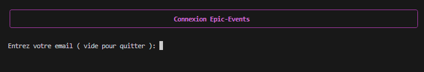

# Epic Events


[](https://sentry.io)


[](https://pytest.org)
[](https://coverage.readthedocs.io/en/latest/)

[](https://www.python.org/dev/peps/pep-0008/)
[](https://flake8.pycqa.org/en/latest/)
[](https://github.com/psf/black)


Création d'une solution de CRM (Customer Relationship Management) en CLI.

Objectif principal est de mettre en place une base de données qui permette de stocker et de manipuler de manière sécurisée les informations des clients, ainsi que les contrats et les événements organisés.Une gestion des collaborateurs et des permissions est aussi mise en place.

## Documents du Projet


1. __[Cahier des charges](docs/Backend+sécurisé_Cahier+des+charges+[2.0].pdf)__
    * Contexte du projet.
    * Exigences du projet.

1. __[Diagramme d'association ERD ( Entity Relationship Diagram) ](docs/Epic_Events_ERD.pdf)__
    * Structure de la base de données.

## Installation et activation de l'environnement Virtuel et des dépendances
Création de l'environnement virtuel : 
```bash
python -m venv .venv
```
Activation de l'environnement virtuel se placer dans le dossier **.venv/scripts** et taper : 
```bash
./activate
```
Installation des dependances necessaires au projet avec poetry : 
```bash
pip install poetry
poetry install

```
## Usage

Le projet utilise une base de données __PostgréSQL__ hébergée sur render.com par défaut, mais il peut etre utilisé avec une base locale en utilisant les données suivantes :

* Nom de la base locale : `epic_events`
* Utilisateur pour la base locale : `epic_events_user`
* Mot de passe pour la base locale : `user_pass_123`

Le choix de la base se fait en activant la variable d'environnement __DB_USE__ sur local dans le fichier __.env__ en __local__ ou __render__, par défaut on se connecte à la base distante render.

Après avoir configuré votre serveur postgré et ajouter la base et le user, les tables et les données tests seront créées automatiquement en lancant l'application dans le dosier __app__ du projet : 

```bash
python main.py
```

Pour ré-initialiser complètement la base se placer dans le dossier __app/dev__ et lancer le script :
```bash
python init_db.py
```

Liste des utilisateurs par défaut :

1. __email:__ commercial_1@email.com  __password:__ password123
2. __email:__ commercial_2@email.com  __password:__ password123
3. __email:__ support_1@email.com  __password:__ password123
4. __email:__ support_2@email.com  __password:__ password123
5. __email:__ gestion_1@email.com  __password:__ password123

* Tous les utilisateurs ont accés aux clients, contrats et évènements en lecture seule.

* Equipe de gestion :
    * Accés total aux utilisateurs et permissions.
    * Accés total aux contrats.
    * Accés aux évènements pour l'affection des supports.

* Equipe commerciale :
    * Création des clients
    * Accés total à leurts clients
    * Création d'évènement pour leurs clients avec contrat signé ( sans affectation de support ).

* Equipe support :
    * Modification des évènements qui leurs sont attribués par l'équipe gestion. 

Exécuter la commande suivante dans le dossier app du projet pour se connecter et lancer l'application :

```bash
python main.py
```



Renseigner l'email et le mot de passe pour arriver sur le menu principal


## Journalisation

L'application possède une __journalisation locale__ et __distante sur Sentry__

### Journalisation locale :
    
    *   app/data/epic_events.log

Logging géré avec un système de rotation de 3 fichiers max, la taille max de chaque fichier est de 1mo :

`epic_events.log` , `epic_events.log1` et `epic_events.log2`

### Journalisation Sentry :

Compte test sur Sentry pour accéder au logging : 

*   __Email :__ `ocstudentgeo@gmail.com`
*   __Mot de passe :__ `Pass_P13_OC_Python`


## Tests

Pour executer les tests se placer dans le dossier racine du projet : 
```
pytest
```
Pour connaitre la couverture totale des tests :
```
pytest --cov=.
```
Pour effectuer un rapport html des tests : 
```
pytest --cov=. --cov-report html
```
Lancer index.html du dossier htlmcov


## Contribuer

Si vous souhaitez contribuer à ce projet, veuillez suivre ces étapes :

    Ouvrez un problème pour discuter de ce que vous souhaitez changer.
    Fork ce dépôt et créez une branche pour votre contribution.
    Soumettez une demande d'extraction avec vos modifications.
